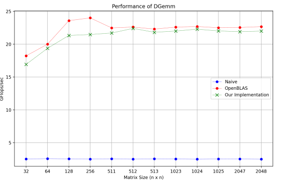
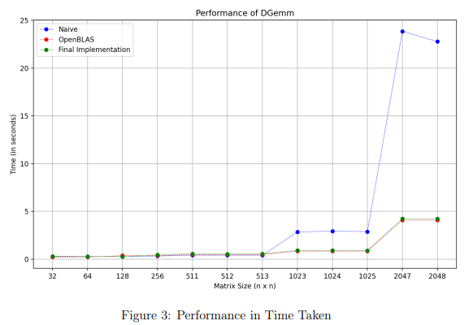

# Optimizing Matrix Multiplication on CPU

Τhe aim is to develop an optimized matrix multiplication routine that performs faster than naive matrix multiplication. We explore efficient cache utilization, structuring of data and utilization of the underlying machine architecture and their effects on performance. Results are presented below and [Report](Report.pdf) explains in detail why our implementation works much faster than naive matrix multiplication.

## Introduction

Matrix multiplication is by far the most studied algorithm in high performance computing. The problem is known for its high "parallelizability" because of the way the data is structured and the arithmetic that happens. It is an important kernel in many real-world problems and can quickly become a bottleneck if not implemented optimally. In [Report](Report.pdf), we demonstrate why the naive multiplication algorithm has much room for optimization. We first show the results of our implementation and then describe how it works in detail.


## Usage

```bash
make
./genDATA.sh
cat data.txt
make clean
```
## Results

The following table compares the performance (GFlops) of different methods

| N | Peak GF (Our code) | Peak GF (OpenBLAS) | Peak GF (Naive) |
| --- | --- | --- | --- |
| 32 | 16.93 | 18.225 | 2.54 |
| 64 | 19.375 | 20 | 2.535 |
| 128 | 21.33 | 23.585 | 2.551 |
| 256 | 21.47 | 24 | 2.569 |
| 511 | 21.7 | 22.48 | 2.51 |
| 512 | 22.4 | 22.61 | 2.53 |
| 513 | 21.81 | 22.3 | 2.571 |
| 1023 | 22 | 22.6 | 2.495 |
| 1024 | 22.28 | 22.685 | 2.55 |
| 1025 | 22.01 | 22.505 | 2.532 |
| 2047 | 21.90 | 22.545 | 2.504 |
| 2048 | 21.99 | 22.67 | 2.52 |





## References

<ol>
  <li> Jianyu Huang and Robert A Van de Geijn. 2016. BLISlab: A Sandbox for Optimizing GEMM. FLAME Working Note #80, TR-16-13. The University of Texas at Austin</li>
  <li> Anatomy of high-performance matrix multiplication. Kazushige Goto, Robert A. van de Geijn. ACM Transactions on Mathematical Software (TOMS), 2008.</li>
  <li>BLIS: A Framework for Rapidly Instantiating BLAS Functionality. Field G. Van Zee, Robert A. van de Geijn. ACM Transactions on Mathematical Software (TOMS), 2015.</li>
  <li>OpenBLAS, an optimized BLAS library. http://www.openblas.net.</li>
  <li> T Low, F Igual, T Smith, E Quintana-Orti, “Analytical Modeling is Enough for High-Performance BLIS”, ACM Transactions On Mathematical Software, Vol 43, No. 2, August 2016</li>
</ol>
